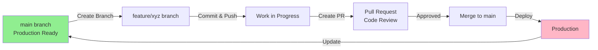
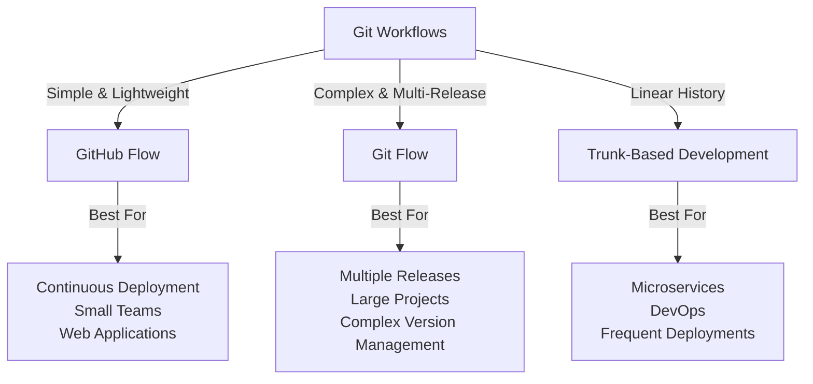
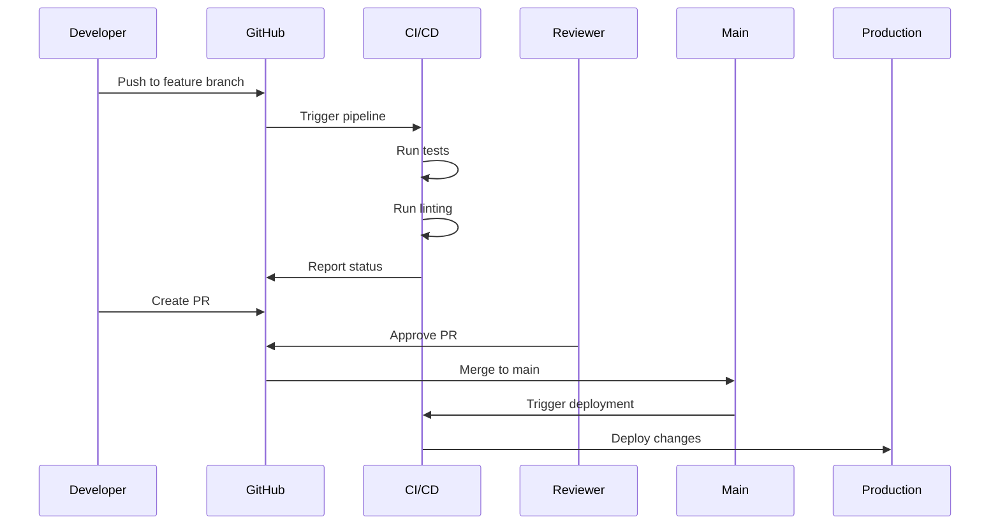

# GitHub Flow

## Overview
GitHub Flow is a lightweight branching strategy for continuous delivery and deployment. It's simpler than Git Flow and ideal for small teams and web applications.

## Core Principles
1. **Main branch is always deployable** - `main` branch is production-ready
2. **Create descriptive branches** - Branch names reflect the feature/fix
3. **Commit & push frequently** - Keep changes small and manageable
4. **Open a Pull Request (PR)** - Request code review before merging
5. **Review & discuss** - Team reviews code quality and functionality
6. **Deploy to production** - Merge to `main` and deploy

## GitHub Flow Workflow



## Step-by-Step Process

### 1. Create a Branch
```bash
git checkout -b feature/add-login-page
```

### 2. Make Changes
- Edit files locally
- Test thoroughly
- Keep commits atomic

### 3. Commit & Push
```bash
git add .
git commit -m "Add user authentication"
git push origin feature/add-login-page
```

### 4. Create Pull Request
- Open PR on GitHub
- Provide clear description
- Link related issues

### 5. Code Review
- Team members review changes
- Request changes if needed
- Approve when satisfied

### 6. Merge & Deploy
```bash
# Merge PR (via GitHub UI)
# Delete feature branch
# Deploy to production
```

## Branch Naming Conventions

| Type | Format | Example |
|------|--------|---------|
| Feature | `feature/*` | `feature/user-auth` |
| Bug Fix | `fix/*` | `fix/login-bug` |
| Hotfix | `hotfix/*` | `hotfix/payment-issue` |
| Documentation | `docs/*` | `docs/api-guide` |

## Comparison with Other Git Strategies



## Best Practices

✅ **DO:**
- Keep branches short-lived (1-3 days)
- Make PRs focused on single feature
- Write clear commit messages
- Test before pushing
- Use PR templates

❌ **DON'T:**
- Merge without code review
- Keep branches for weeks
- Mix multiple features in one PR
- Force push to shared branches
- Skip tests

## Integration with CI/CD



## Key Advantages

| Advantage | Benefit |
|-----------|---------|
| **Simple** | Easy to learn & implement |
| **Scalable** | Works for teams of any size |
| **Safe** | PR-based quality gates |
| **Fast** | Rapid deployments |
| **Flexible** | Adapts to various workflows |

## Common Commands Reference

```bash
# Create & switch to new branch
git checkout -b feature/feature-name

# View all branches
git branch -a

# Push branch to remote
git push origin feature-name

# Delete local branch
git branch -d feature-name

# Delete remote branch
git push origin --delete feature-name

# View PR status
gh pr view
```

---
**When to use GitHub Flow:** Continuous deployment, web apps, small-to-medium teams, rapid iteration cycles.
